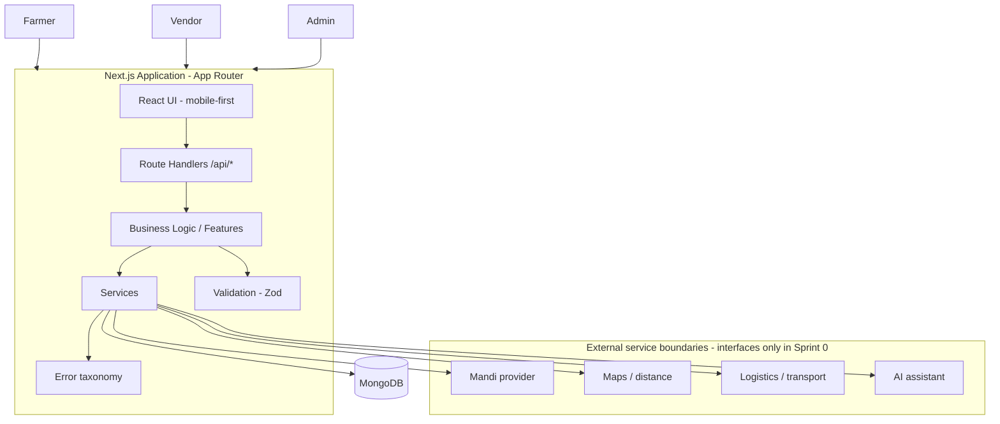
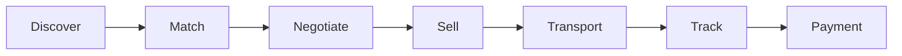

# Kisan Vyapar — System Architecture

## High-level view



## Product flow



## Repository layout

```text
Kisan-Vyapar/
├── src/
│   ├── app/                 # App Router pages + /api route handlers
│   ├── components/          # React components (ui, shared, role-scoped)  [future]
│   ├── features/            # Feature-specific application logic           [future]
│   ├── lib/                 # Cross-cutting utilities
│   │   ├── api/             #   response helpers, error wrapper
│   │   ├── db/              #   Mongo/Mongoose connection utility
│   │   ├── errors/          #   error taxonomy + safe HTTP envelopes
│   │   └── validation/      #   shared Zod schemas + parse helper
│   ├── services/            # External/business service boundaries
│   │   ├── mandi/ maps/ logistics/ ai/ matching/ realization/
│   ├── models/              # Mongoose schemas/models
│   ├── types/               # Shared TypeScript types
│   ├── constants/           # Centralized domain constants
│   └── config/              # Centralized server configuration
├── docs/                    # Documentation set (01–10)
├── public/
└── ...
```

Planned route segments under `src/app` (created when their first page/route lands):
`(auth)`, `farmer`, `vendor`, `admin`, `api`.

## Separation of concerns

- **UI** renders and reacts; contains no business logic.
- **Features** own feature-specific application logic.
- **Services** own external integrations and business operations.
- **Models** own Mongo schemas.
- **Validation** (Zod) guards application boundaries.
- **Types / constants / config** centralize shared vocabulary.
- **Route handlers** receive → validate → authorize (later) → call services → respond.

## Status summary

- **Implemented:** app shell, config, DB connection, models, constants, types,
  error/API utilities, `/api/health`, service interfaces, docs.
- **Planned:** auth, role dashboards, listing/requirement CRUD, matching, offers,
  orders, market ingestion adapters.
- **Future:** payments, logistics execution, AI advisor, multilingual engine,
  voice, ratings engine.

No unimplemented system is documented as if it works.
