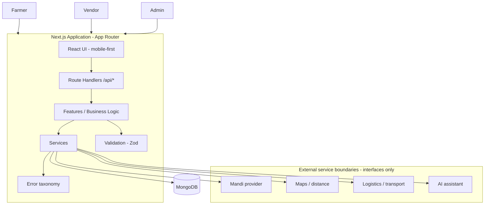
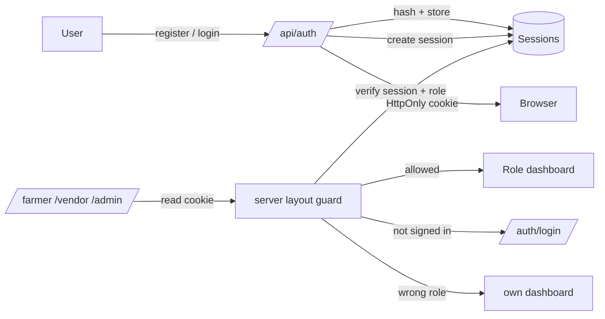

# Kisan Vyapar — System Architecture

## High-level view



## Authentication & authorization flow



## Repository layout

```text
Kisan-Vyapar/
├── src/
│   ├── app/                 # Pages + /api route handlers
│   │   ├── (auth flows)     #   /auth/login, /auth/register, /onboarding
│   │   ├── farmer|vendor|admin  #   protected role areas
│   │   └── api/             #   /api/auth/*, /api/profile, /api/health
│   ├── components/
│   │   ├── ui/              # reusable design-system primitives
│   │   ├── auth/            # login/register/logout components
│   │   ├── profiles/        # farmer/vendor profile forms
│   │   ├── dashboard/       # role dashboard shell
│   │   └── shared/          # brand
│   ├── features/
│   │   ├── auth/            # schemas, service, session store, guards
│   │   └── profiles/        # schemas, service, completeness rules
│   ├── lib/
│   │   ├── api/             # response/error/request helpers
│   │   ├── client/          # typed client fetch helper
│   │   ├── db/              # MongoDB connection
│   │   ├── errors/          # error taxonomy + safe envelopes
│   │   ├── utils/           # cn, greeting
│   │   └── validation/      # shared Zod schemas
│   ├── services/            # mandi, maps, logistics, ai, matching, realization
│   ├── models/              # Mongoose models (User, profiles, Session, …)
│   ├── types/  constants/  config/
├── docs/                    # documentation set (01–10)
├── tests/                   # test-only helpers (server-only stub)
└── ...
```

Future route segments under `src/app` (created when their first page lands):
`(auth)` grouping is intentionally not used yet; auth pages live at `/auth/*`.

## Separation of concerns

- **UI** renders and reacts; contains no business logic.
- **Features** own feature logic (`features/auth`, `features/profiles`).
- **Services** own external/business operations.
- **Models** own Mongo schemas.
- **Validation** (Zod) guards boundaries; config validated in `src/config`.
- **Route handlers** receive → validate → authorize → call services → respond.
- **Layouts/pages** enforce role access server-side (never client-only).

## Status summary

- **Implemented (Sprint 1):** registration, role selection, bcrypt passwords,
  DB-backed sessions + logout, session endpoint, farmer/vendor profiles with
  completion flow, server-enforced role authorization, farmer/vendor/admin
  dashboard shells, reusable UI kit, responsive layouts, Vitest coverage.
- **Implemented (Sprint 2):** crop catalogue + produce CRUD with ownership.
- **Implemented (Sprint 3–4):** market/mandi price pipeline + deterministic
  price guidance engine (see `docs/07-Algorithms/pricing-guidance.md`).
- **Implemented (Sprint 5):** vendor buying requirements with a controlled
  lifecycle, an intentional produce publish flow, and a deterministic,
  explainable matching engine (`features/buyer-requirements` +
  `features/matching`; algorithm in `docs/07-Algorithms/matching-guidance.md`).
- **Planned (Sprint 6+):** offers/negotiation, orders, matching across
  requirements in more detail.
- **Future:** payments, logistics execution, AI advisor, multilingual engine,
  voice, ratings, admin tooling.

No unimplemented system is documented as if it works.
