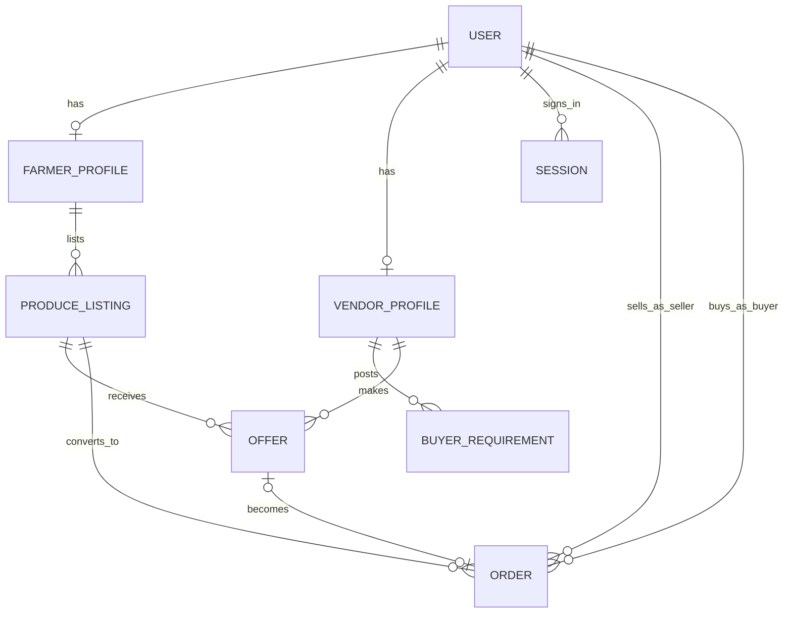

# Kisan Vyapar — Database Design

## Stack

- **MongoDB** with **Mongoose** (ODM).
- Connection managed centrally in `src/lib/db/mongodb.ts`; a single cached
  connection is reused across requests and survives Next.js dev hot reload.
- Connection string + database name come from validated server environment
  (`MONGODB_URI`, `DATABASE_NAME`).

## Conventions

- Every model lives in `src/models/*.ts` and exports a typed model
  (`UserModel`, `ProduceListingModel`, ...) plus its document interface.
- Model *names* are centralized in `src/models/model-names.ts` (`MODEL_NAMES`)
  and used for registration and `ref` values — no scattered collection strings.
- Enum-like string fields reference centralized constants under `src/constants/`
  rather than inline literals.
- `timestamps: true` on all top-level models.
- References are `ObjectId` + `ref`; relationships are explicit.
- Indexes are declared for the query patterns the domain is expected to need.
- Sensitive values (`passwordHash`) are stored with `select: false` and are not
  returned by default.

## Entity map

## Models

### User
Role-based identity record.

| Field | Type | Notes |
| --- | --- | --- |
| role | enum | `farmer` / `vendor` / `admin` |
| fullName | string | required |
| phone | string | required, unique index |
| email | string | optional, unique sparse index |
| phoneVerified | bool | default false |
| passwordHash | string | optional; `select: false`; set by auth (bcrypt) |
| language | enum | default `en` |
| status | enum | `active` / `suspended` |

### Session
Authentication sessions for signed-in users.

| Field | Type | Notes |
| --- | --- | --- |
| user | ObjectId → User | required |
| tokenHash | string | sha-256 of the opaque session token; unique index |
| expiresAt | date | TTL index (`expireAfterSeconds: 0`) auto-removes expired sessions |
| createdAt / updatedAt | date | timestamps |

The raw token is stored only in the user's HttpOnly cookie; the database stores a
hash, so a DB read cannot be used to impersonate a session.

### FarmerProfile
One per farmer user (`user` unique).

| Field | Type | Notes |
| --- | --- | --- |
| user | ObjectId → User | unique |
| bio | string | optional |
| location | nested | label + geo (Point) + postal address; `2dsphere` index |

### VendorProfile
One per vendor user (`user` unique).

| Field | Type | Notes |
| --- | --- | --- |
| user | ObjectId → User | unique |
| businessName | string | required |
| businessType | enum | retailer / wholesaler / processor / exporter |
| location | nested | as FarmerProfile |

### ProduceListing
A farmer's offer to sell a crop.

| Field | Type | Notes |
| --- | --- | --- |
| farmer | ObjectId → FarmerProfile | required |
| crop | string | free-text name (future: catalog id) |
| variety / quality | string | optional descriptions |
| quantity / unit | number + enum | required; unit: kg/quintal/tonne |
| pricePerUnit / currency | number + enum | required; default INR |
| images | string[] | image URLs (storage later) |
| availableFrom | date | optional |
| location | nested | pickup point |
| status | enum | draft / active / sold_out / withdrawn |

Indexes: `(farmer, status)`, `(crop, status)`, `(status, createdAt)`, geo.

### BuyerRequirement
A vendor's need-to-buy record.

| Field | Type | Notes |
| --- | --- | --- |
| vendor | ObjectId → VendorProfile | required |
| crop, variety, quality | strings | as listing |
| quantity / unit | number + enum | required |
| maxPricePerUnit / currency | number + enum | required; default INR |
| requiredBy | date | required |
| location | nested | pickup point |
| status | enum | draft / open / fulfilled / cancelled |

Indexes: `(vendor, status)`, `(crop, status)`, `(status, requiredBy)`, geo.

### MarketPrice
Normalized market/mandi price snapshot (future ingestion).

| Field | Type | Notes |
| --- | --- | --- |
| commodity / variety | strings | normalized crop identity |
| market / district / state | strings | where the price was observed |
| unit | enum | price basis |
| minPrice / maxPrice / modalPrice | numbers | modal required |
| currency | enum | default INR |
| arrivalDate / recordedAt | dates | observed time |
| externalId | string | optional provider id; unique sparse |

Indexes: `(commodity, market, recordedAt)`, `(state, district, market)`, geo not needed.

### Offer
A vendor's bid on a produce listing (negotiation foundation).

| Field | Type | Notes |
| --- | --- | --- |
| produceListing | ObjectId → ProduceListing | required |
| vendor | ObjectId → VendorProfile | required |
| offeredPricePerUnit / currency | number + enum | required |
| quantity / unit | number + enum | required |
| validUntil | date | optional |
| message | string | optional |
| status | enum | pending / accepted / rejected / withdrawn |

Indexes: `(produceListing, status)`, `(vendor, status)`, `(status, createdAt)`.

### Order
An agreement to transact between a farmer (seller) and a vendor (buyer).

| Field | Type | Notes |
| --- | --- | --- |
| orderNumber | string | optional; unique sparse (generation later) |
| produceListing | ObjectId → ProduceListing | required |
| offer | ObjectId → Offer | optional link to source offer |
| seller / buyer | ObjectId → User | required (farmer user / vendor user) |
| quantity / unit | number + enum | required |
| agreedPricePerUnit / currency | number + enum | required |
| totalValue | number | required (computed by caller/service) |
| status | enum | pending / confirmed / in_transit / delivered / completed / cancelled |
| cancellationReason | string | optional |

Indexes: `(seller, status)`, `(buyer, status)`, `(produceListing, status)`,
`(orderNumber)` unique sparse.

## Deliberately deferred

- `Payment`, `Transport`, `Review`, `Notification` collections are **not** modeled
  yet. Their status vocabularies exist as constants (see `src/constants/`), and
  they will be added with the sprints that actually use them.
- Standardized crop/master catalog and quality grades are deferred; `crop` and
  `quality` remain human-readable strings until a catalog is justified.

## Status of testing

Unit tests exercise schema-level validation locally (e.g. `user.validation.test.ts`
validates required/enum/match rules via `doc.validate()` without a database), and
all code compiles and lints. A **live manual verification was performed against a
running MongoDB** (development database): registration (farmer and vendor),
session creation/read/revoke, duplicate-account conflict, profile upsert + read,
authenticated dashboard access, logout, and login (including a wrong-password
rejection). Automated database integration tests (real connection or
`mongodb-memory-server`) are still future work; index creation, unique
constraints, and TTL expiry were not exhaustively asserted automatically.
