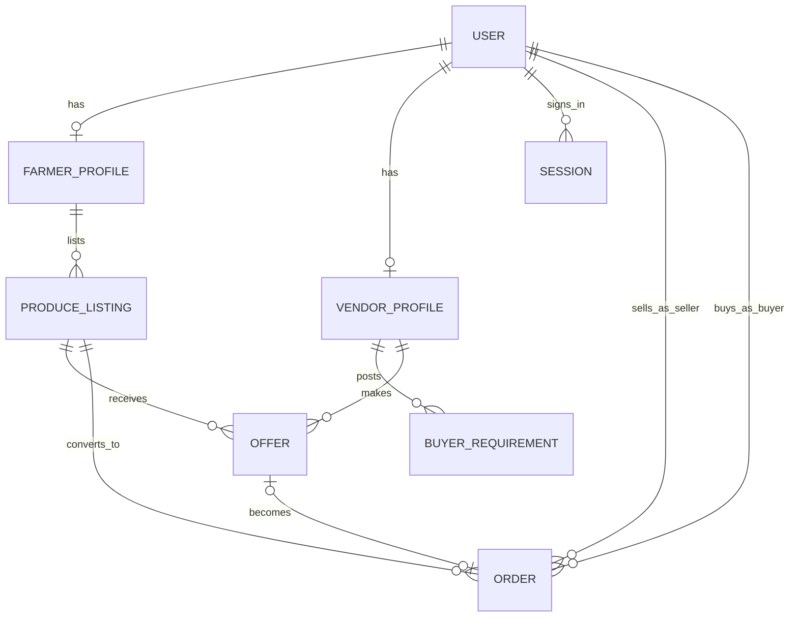

# Kisan Vyapar — Database Design

## Stack

- **MongoDB** with **Mongoose** (ODM).
- Connection managed centrally in `src/lib/db/mongodb.ts`; a single cached
  connection is reused across requests and survives Next.js dev hot reload.
- Connection string + database name come from validated server environment
  (`MONGODB_URI`, `DATABASE_NAME`).

## Conventions

- Every model lives in `src/models/*.ts` and exports a typed model
  (`UserModel`, `ProduceListingModel`, ...) plus its document interface.
- Model *names* are centralized in `src/models/model-names.ts` (`MODEL_NAMES`)
  and used for registration and `ref` values — no scattered collection strings.
- Enum-like string fields reference centralized constants under `src/constants/`
  rather than inline literals.
- `timestamps: true` on all top-level models.
- References are `ObjectId` + `ref`; relationships are explicit.
- Indexes are declared for the query patterns the domain is expected to need.
- Sensitive values (`passwordHash`) are stored with `select: false` and are not
  returned by default.

## Entity map

## Models

### User
Role-based identity record.

| Field | Type | Notes |
| --- | --- | --- |
| role | enum | `farmer` / `vendor` / `admin` |
| fullName | string | required |
| phone | string | required, unique index |
| email | string | optional, unique sparse index |
| phoneVerified | bool | default false |
| passwordHash | string | optional; `select: false`; set by auth (bcrypt) |
| language | enum | default `en` |
| status | enum | `active` / `suspended` |

### Session
Authentication sessions for signed-in users.

| Field | Type | Notes |
| --- | --- | --- |
| user | ObjectId → User | required |
| tokenHash | string | sha-256 of the opaque session token; unique index |
| expiresAt | date | TTL index (`expireAfterSeconds: 0`) auto-removes expired sessions |
| createdAt / updatedAt | date | timestamps |

The raw token is stored only in the user's HttpOnly cookie; the database stores a
hash, so a DB read cannot be used to impersonate a session.

### FarmerProfile
One per farmer user (`user` unique).

| Field | Type | Notes |
| --- | --- | --- |
| user | ObjectId → User | unique |
| bio | string | optional |
| location | nested | label + geo (Point) + postal address; `2dsphere` index |

### VendorProfile
One per vendor user (`user` unique).

| Field | Type | Notes |
| --- | --- | --- |
| user | ObjectId → User | unique |
| businessName | string | required |
| businessType | enum | retailer / wholesaler / processor / exporter |
| location | nested | as FarmerProfile |

### ProduceListing
A farmer's structured crop record (Sprint 2).

| Field | Type | Notes |
| --- | --- | --- |
| farmer | ObjectId → FarmerProfile | required; ownership scoping |
| crop | string | supported catalogue id (e.g. `tomato`), lowercase |
| variety | string | optional; cleared when incompatible with crop |
| quality | enum | `a` / `b` / `c` / `ungraded` (default `ungraded`) |
| quantity / unit | number + enum | required (min 1); kg/quintal/tonne |
| pricePerUnit | number | **optional** — intentionally unset until market-price workflow |
| currency | enum | default INR |
| images | string[] | reserved (storage later) |
| expectedHarvestDate | date | harvest readiness |
| location | nested | listing copy of profile address (profile never overwritten) |
| status | enum | `draft` / `active` / `sold_out` / `withdrawn` — **new listings start as `draft`** |

Indexes: `(farmer, status, createdAt)`, `(crop, status)`, geo `2dsphere`. Matching
only ever queries `status: "active"` produce (intentionally published), so
drafts/deactivated listings are excluded at the database layer.

### BuyerRequirement
A vendor's need-to-buy record (Sprint 5 — the source of marketplace demand).

| Field | Type | Notes |
| --- | --- | --- |
| vendor | ObjectId → VendorProfile | required; ownership scoping |
| crop | string | supported catalogue id (e.g. `tomato`), lowercase |
| variety | string | optional |
| quality | enum | `a` / `b` / `c` / `ungraded` — matches produce grades so matching is exact |
| quantity / unit | number + enum | required (min 1); kg/quintal/tonne |
| targetPriceMin / targetPriceMax | numbers | required (min 0, max ≥ min — enforced by Zod at the boundary) |
| currency | enum | default INR |
| requiredBy | date | required; cannot be in the past |
| notes | string | optional (≤ 400) |
| location | nested | preferred region (district + state required) for honest region matching |
| status | enum | `active` / `paused` / `fulfilled` / `expired` / `cancelled` (default `active`) |

A requirement is created `active` and its lifecycle is **controlled server-side**:
only active can be paused/fulfilled, only paused can be resumed, active/paused can
be cancelled, and active requirements whose `requiredBy` has passed are treated as
`expired`.

Indexes: `(vendor, status, createdAt)`, `(crop, status)`, `(status, requiredBy)`,
geo `2dsphere`. The `(crop, status)` + `(status, requiredBy)` pair backs the
matching pre-filter (active, future-dated, same crop) before any scoring runs.

### MarketPrice
Normalized market/mandi observation (Sprint 3 ingestion pipeline).

| Field | Type | Notes |
| --- | --- | --- |
| commodity | string | required; source commodity name |
| crop | string | optional Kisan Vyapar catalogue id when mapped |
| variety / grade | strings | optional |
| market / district / state | strings | market + district required, state optional |
| unit | enum | price basis (kg/quintal/tonne) |
| minPrice / maxPrice / modalPrice | numbers | modal required; min ≤ max enforced at ingestion |
| currency | enum | default INR |
| arrivalDate | date | date of the market observation (history key) |
| source | string | provider label |
| fetchedAt | date | when we fetched/persisted |
| recordKey | string | deterministic dedupe key; unique sparse |
| externalId | string | optional provider id; unique sparse |

One document per (source, commodity, market, arrival date, variety, grade) — a
re-fetch on the same day upserts in place; a new arrival date creates a **new**
document, preserving history. Indexes: `(crop, state, district, arrivalDate)`,
`(commodity, state, market, arrivalDate)`, unique sparse `recordKey`/`externalId`.

### Offer
A vendor's bid on a produce listing (negotiation foundation).

| Field | Type | Notes |
| --- | --- | --- |
| produceListing | ObjectId → ProduceListing | required |
| vendor | ObjectId → VendorProfile | required |
| offeredPricePerUnit / currency | number + enum | required |
| quantity / unit | number + enum | required |
| validUntil | date | optional |
| message | string | optional |
| status | enum | pending / accepted / rejected / withdrawn |

Indexes: `(produceListing, status)`, `(vendor, status)`, `(status, createdAt)`.

### Order
An agreement to transact between a farmer (seller) and a vendor (buyer).

| Field | Type | Notes |
| --- | --- | --- |
| orderNumber | string | optional; unique sparse (generation later) |
| produceListing | ObjectId → ProduceListing | required |
| offer | ObjectId → Offer | optional link to source offer |
| seller / buyer | ObjectId → User | required (farmer user / vendor user) |
| quantity / unit | number + enum | required |
| agreedPricePerUnit / currency | number + enum | required |
| totalValue | number | required (computed by caller/service) |
| status | enum | pending / confirmed / in_transit / delivered / completed / cancelled |
| cancellationReason | string | optional |

Indexes: `(seller, status)`, `(buyer, status)`, `(produceListing, status)`,
`(orderNumber)` unique sparse.

## Deliberately deferred

- `Payment`, `Transport`, `Review`, `Notification` collections are **not** modeled
  yet. Their status vocabularies exist as constants (see `src/constants/`), and
  they will be added with the sprints that actually use them.
- A supported **crop catalogue** (`src/constants/crops.ts`) and **quality grades**
  (`src/constants/quality-grades.ts`) are implemented; `ProduceListing.crop` stores
  a catalogue id. Free-text custom crops are not allowed (documented future
  enhancement).
- Market/mandi price collection is deliberately not modelled yet.

## Status of testing

Unit tests exercise schema-level validation locally (e.g. `user.validation.test.ts`
validates required/enum/match rules via `doc.validate()` without a database), and
all code compiles and lints. During Sprint 1 a **live manual verification was
performed against a running MongoDB** (auth + profiles). During Sprint 2 the
planned live produce CRUD/ownership run **could not be executed**: the configured
MongoDB Atlas cluster was unreachable from this network (IP whitelist) at
verification time — **NOT VERIFIED**. Automated database integration tests (real
connection or `mongodb-memory-server`) remain future work.
